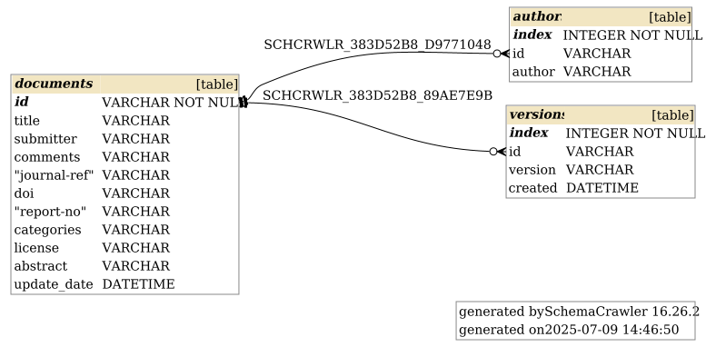

# arXiv Database

> Code to convert the
> [arXiv Dataset](https://www.kaggle.com/datasets/Cornell-University/arxiv) from
> JSON to a SQLite3 database

## Table of Contents

- [arXiv Database](#arxiv-database)
  - [Table of Contents](#table-of-contents)
  - [About](#about)
  - [System Dependencies](#system-dependencies)
  - [Using `arxivdb`](#using-arxivdb)
    - [Install With `pip`](#install-with-pip)
    - [Install with `pipx`](#install-with-pipx)
    - [Build From Source](#build-from-source)
    - [Command Line Options](#command-line-options)
      - [`arxivdb --help`](#arxivdb---help)
  - [Ouput Database Schema](#ouput-database-schema)

## About

From the [arXiv info page](https://info.arxiv.org/about/index.html) (as of July
9th, 2025):

*arXiv is a curated research-sharing platform open to anyone. As a pioneer in
digital open access, arXiv.org now hosts more than two million scholarly
articles in eight subject areas, curated by our strong community of volunteer
moderators.*

arXiv offers a dataset that is updated approximately every month on
[Kaggle](https://www.kaggle.com/datasets/Cornell-University/arxiv). This dataset
contains the *metadata* of most hosted articles. While the dataset is fairly
comprehensive (2,748,902 articles captured as of July 9th, 2025), the released
format of this dataset limits the querying capabilities of it.

This project converts the arXiv Dataset from JSON to SQLite3 to support language
agnostic querying and distribution. A blog post about this project is availible
on [Dev.to](https://dev.to/nicholassynovic/creating-an-arxiv-db-940).

## System Dependencies

`arxivdb` depends on the following system utilities:

- `Python 3.13`
- `SQLite3`

## Using `arxivdb`

### Install With `pip`

`pip install git+https://github.com/NicholasSynovic/arxivdb.git`

### Install with `pipx`

`pipx install "git+https://github.com/NicholasSynovic/arxivdb.git"`

### Build From Source

```shell
git clone https://github.com/NicholasSynovic/arxivdb.git
cd arxivdb/
make create-dev
make build
```

### Command Line Options

#### `arxivdb --help`

```shell
usage: arxivdb [-h] [-c CHUNKSIZE] -i INPUT -o OUTPUT [-v]

Process arXiv metadata and store it in an SQLite3 database.

options:
  -h, --help            show this help message and exit
  -c, --chunksize CHUNKSIZE
                        Number of JSON lines to chunk when parsing the arXiv dataset
  -i, --input INPUT     Path to a JSON Lines arXiv metadata file
  -o, --output OUTPUT   Path to store SQLite3 database
  -v, --version         show program's version number and exit

Copyright (C) 2025 Nicholas M. Synovic.
```

## Ouput Database Schema

The following image is the latest database schema that `arxivdb` creates from
the dataset:


