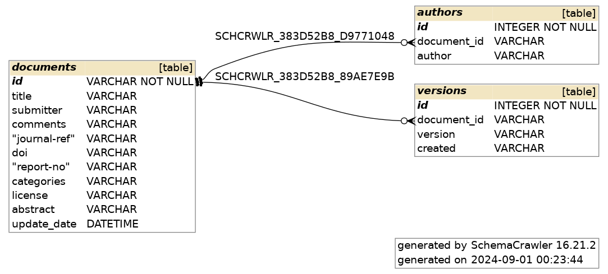

# arXiv Database

> Code to convert the
> [arXiv Dataset](https://www.kaggle.com/datasets/Cornell-University/arxiv) from
> JSON to an SQLite3 database

## Table of Contents

- [arXiv Database](#arxiv-database)
  - [Table of Contents](#table-of-contents)
  - [About](#about)
  - [How To Create Your Dataset](#how-to-create-your-dataset)
  - [Database Schema](#database-schema)

## About

This project is meant to convert the arXiv Dataset from JSON to SQLite3 to
support language agnostic querying and distribution.

A blog post about this project is availible on
[Dev.to](https://dev.to/nicholassynovic/creating-an-arxiv-db-940).

## How To Create Your Dataset

> NOTE: Wherever you see `DATASET`, replace it with the relevant path or
> directory

1. `git clone https://github.com/NicholasSynovic/tool_arXiv-db`
1. `cd tool_arXiv-db`
1. `make create-dev && make build`
1. `kaggle datasets download --unzip Cornell-University/arxiv -p DATASET`
1. `jq -c . DATASET.json > DATASET.jsonlines`
1. `arXiv-db -i DATASET.jsonlines -o DATASET.sqlite3`

## Database Schema

